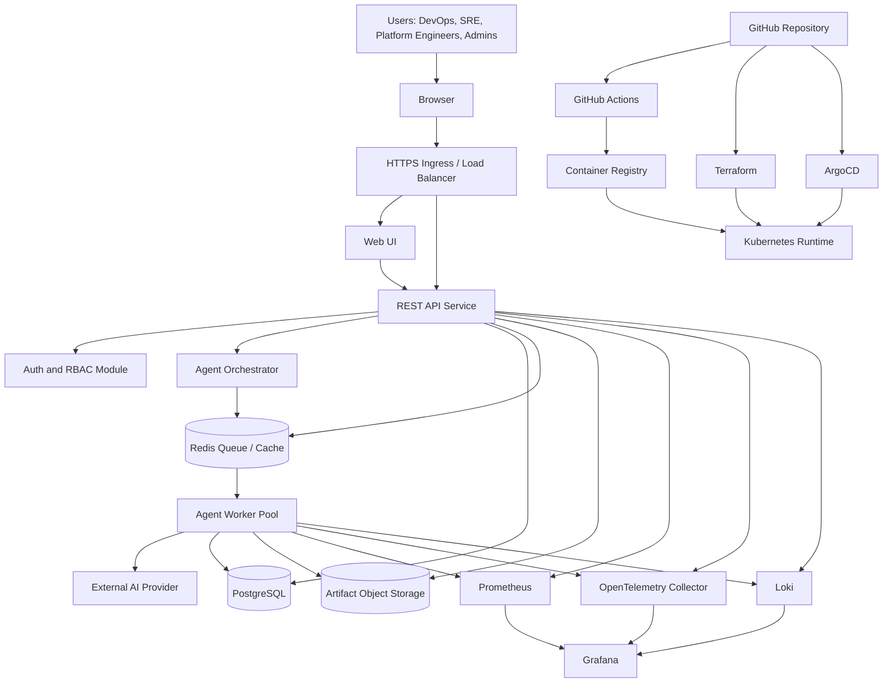
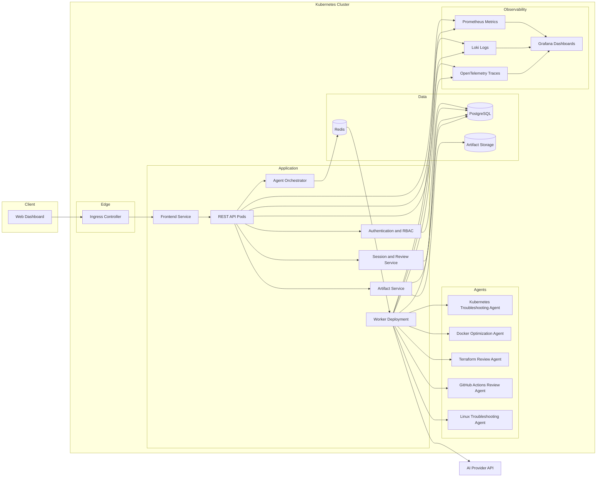
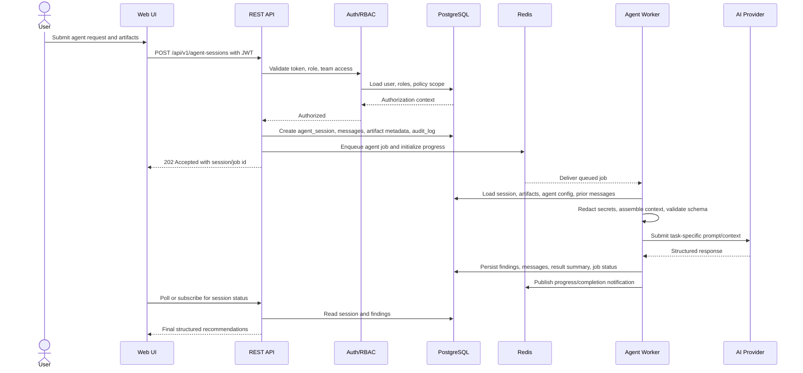
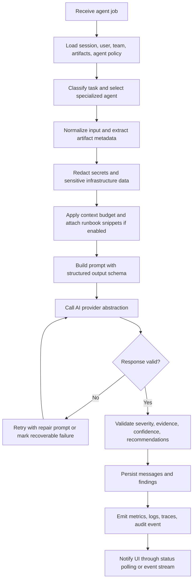
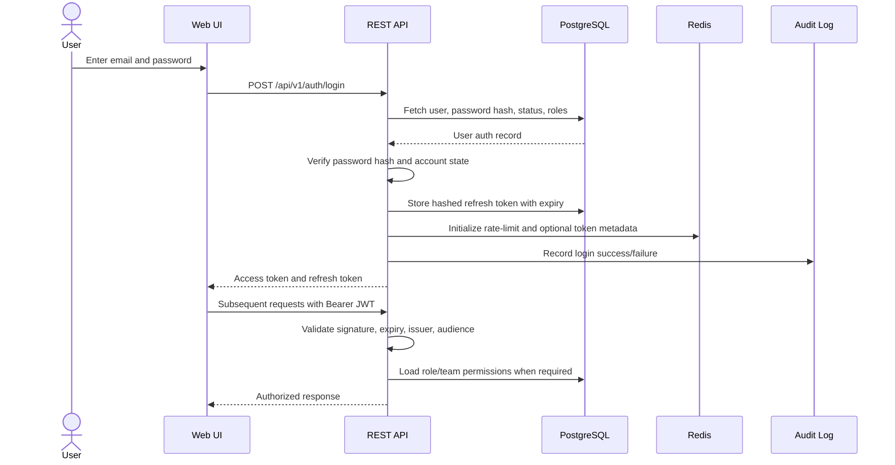
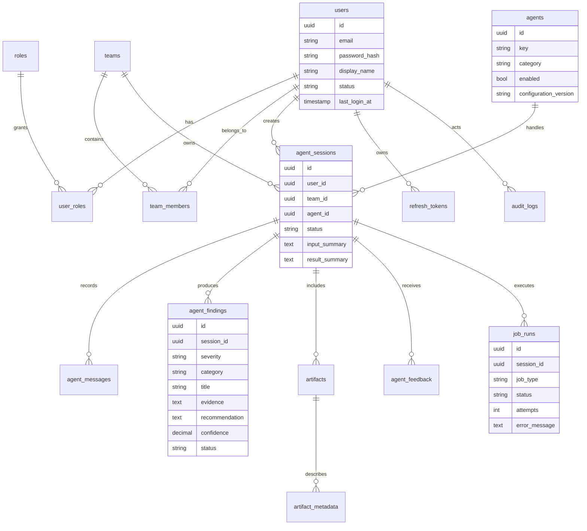
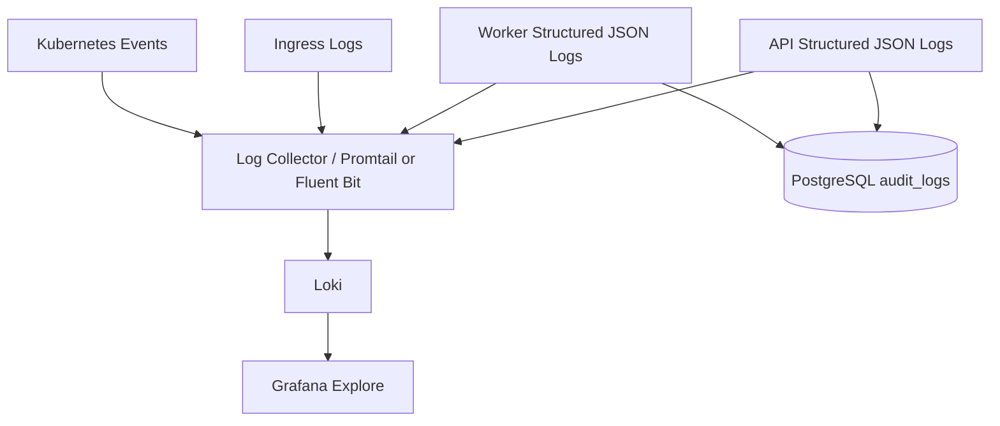
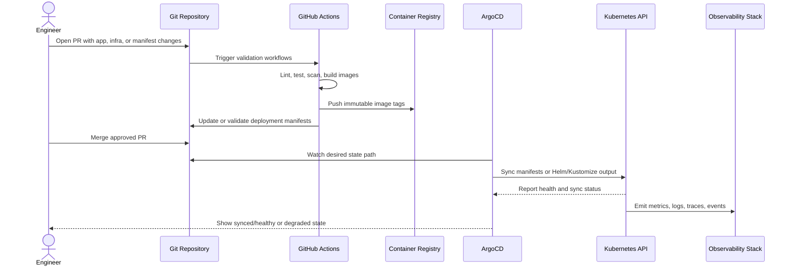
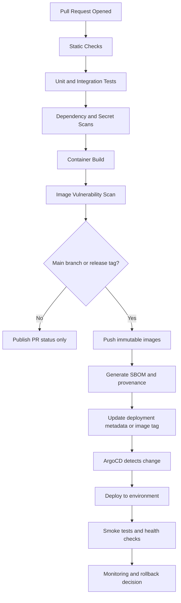

# AI-Powered DevOps Platform: Enterprise Product and Architecture Design

## 1. Product Vision

The AI-Powered DevOps Platform is an enterprise-grade platform engineering and operations assistant that helps DevOps, SRE, and platform teams diagnose infrastructure issues, review delivery workflows, and improve operational maturity across Kubernetes, Docker, Terraform, GitHub Actions, Linux systems, and cloud-native observability stacks.

The platform demonstrates a realistic senior-level DevOps portfolio by combining a production-style web application, secure REST API, multiple task-specific AI agents, persistent data services, cloud-native deployment patterns, GitOps operations, infrastructure as code, and end-to-end observability.

### Strategic Goals

- Provide a centralized self-service portal for DevOps troubleshooting and review workflows.
- Use specialized AI agents to augment engineers rather than replace review and approval processes.
- Demonstrate modern platform engineering concepts including golden paths, internal developer portals, automated reviews, and operational guardrails.
- Showcase production-ready deployment practices using Docker, Kubernetes, Terraform, GitHub Actions, ArgoCD, PostgreSQL, Redis, JWT authentication, Prometheus, Grafana, Loki, and OpenTelemetry.
- Present a portfolio-quality system that can be discussed in senior DevOps, SRE, platform engineering, and cloud architecture interviews.

### Target Users

- DevOps engineers investigating CI/CD, container, Kubernetes, or infrastructure issues.
- Platform engineers building reusable operational tooling for application teams.
- SREs analyzing incidents, logs, traces, deployment behavior, and system health.
- Engineering managers seeking visibility into operational bottlenecks and review history.
- Developers who need guided troubleshooting without deep infrastructure expertise.

## 2. Functional Requirements

### Authentication and User Management

- Users can register, authenticate, and receive JWT access tokens.
- Users can log in and log out securely.
- The platform supports role-based access control for administrators, engineers, reviewers, and read-only users.
- Authenticated users can manage their profile and view their historical AI-assisted sessions.
- Administrators can manage users, teams, permissions, and agent access policies.

### AI Agent Orchestration

- Users can select a specialized AI agent based on the DevOps task category.
- The platform supports multiple agents with distinct prompts, tools, context policies, and output formats.
- The system records agent conversations, recommendations, confidence levels, and user feedback.
- Agents can reference uploaded artifacts such as Kubernetes manifests, Dockerfiles, Terraform plans, workflow files, logs, and shell command output.
- Agents produce structured recommendations, risk summaries, remediation plans, and follow-up questions.

### Kubernetes Troubleshooting

- Users can submit Kubernetes events, pod descriptions, logs, manifests, and cluster symptoms.
- The Kubernetes troubleshooting agent identifies likely root causes such as image pull failures, crash loops, probe failures, resource pressure, scheduling failures, RBAC issues, networking issues, and misconfigured services.
- The platform generates a prioritized investigation checklist and remediation plan.

### Docker Optimization

- Users can submit Dockerfiles and container build metadata.
- The Docker optimization agent reviews image size, layer efficiency, build caching, security posture, base image selection, dependency installation, and runtime user configuration.
- The platform returns optimization recommendations and production-hardening guidance.

### Terraform Review

- Users can upload Terraform files, plans, or summarized diffs.
- The Terraform review agent identifies security risks, missing state-management practices, excessive privileges, missing tagging strategies, unsafe changes, drift concerns, and maintainability issues.
- The platform supports review status tracking and historical review comparison.

### GitHub Actions Review

- Users can submit GitHub Actions workflow files.
- The GitHub Actions review agent evaluates workflow security, permissions, caching, concurrency, environment protection, secret usage, matrix strategies, artifact handling, and deployment gates.
- The platform provides review comments and recommended pipeline improvements.

### Linux Troubleshooting

- Users can submit command output, system logs, kernel messages, service status, disk metrics, network diagnostics, and process data.
- The Linux troubleshooting agent identifies common operational issues involving CPU, memory, disk, networking, DNS, systemd services, file permissions, package conflicts, and kernel-level errors.
- The platform produces triage steps and safe remediation guidance.

### Observability

- The platform exposes application metrics for Prometheus scraping.
- Distributed traces are emitted with OpenTelemetry.
- Structured logs are collected and queryable through Loki.
- Grafana dashboards visualize API latency, agent execution time, request volume, error rate, authentication failures, queue depth, database health, Redis usage, and Kubernetes deployment status.

### CI/CD and GitOps

- GitHub Actions runs validation, linting, testing, container builds, vulnerability scanning, and image publication.
- ArgoCD continuously reconciles Kubernetes manifests or Helm/Kustomize overlays from the GitOps repository path.
- Terraform provisions required infrastructure such as Kubernetes clusters, namespaces, databases, Redis, container registry resources, IAM policies, and monitoring prerequisites.

## 3. Non-functional Requirements

### Security

- JWT authentication must use short-lived access tokens and refresh-token rotation.
- Passwords must be hashed using a strong adaptive hashing algorithm.
- API endpoints must enforce authorization consistently.
- Secrets must not be committed to source control and must be provided through Kubernetes Secrets, external secret managers, or sealed secret workflows.
- Agent inputs and outputs must be stored with tenant-aware access controls.
- Uploaded files must be scanned, size-limited, and validated before processing.
- CI/CD workflows must follow least-privilege permissions.
- Container images must run as non-root users where possible.

### Reliability

- The API should be horizontally scalable and stateless except for PostgreSQL and Redis dependencies.
- Agent jobs should be queued and retryable.
- Long-running AI operations should not block API request threads.
- Health, readiness, and liveness endpoints must be available for Kubernetes probes.
- Database migrations should be versioned and repeatable.
- The platform should tolerate temporary AI-provider failures through retries, fallback messages, and graceful degradation.

### Performance

- Standard REST API requests should respond within 300 ms at p95 under normal load, excluding long-running AI calls.
- Agent task submission should return quickly with a job or session identifier.
- AI agent processing should stream progress or status updates for long operations.
- Redis should cache common metadata, session lookups, rate-limit counters, and short-lived orchestration state.

### Scalability

- API replicas can scale independently from worker replicas.
- Agent workers can be scaled by queue depth, CPU usage, or custom metrics.
- PostgreSQL should support connection pooling.
- Observability components should support retention policies appropriate for portfolio and demonstration environments.

### Compliance and Governance

- The platform should maintain audit logs for authentication, agent execution, artifact upload, administrative changes, and review status changes.
- AI recommendations should be clearly labeled as assistive and should not automatically mutate production systems.
- Sensitive infrastructure data should be redacted before being sent to external AI providers unless explicitly permitted.

### Maintainability

- The repository should separate application code, infrastructure code, deployment manifests, documentation, and operational runbooks.
- The architecture should support replacing the AI provider or adding additional agents without large rewrites.
- Each service should have clear ownership boundaries and interface contracts.

## 4. Features

### Core Platform Features

- Secure login and JWT-based authentication.
- Responsive web dashboard for agent selection, task submission, and result review.
- REST API for authentication, users, teams, agents, sessions, artifacts, reviews, and observability metadata.
- Agent execution history with searchable sessions.
- Artifact upload and structured metadata extraction.
- Feedback collection for agent response quality.
- Admin dashboard for user and agent configuration.

### AI Agent Features

- Kubernetes troubleshooting agent.
- Docker optimization agent.
- Terraform review agent.
- GitHub Actions review agent.
- Linux troubleshooting agent.
- Shared agent orchestration service.
- Prompt and policy configuration per agent.
- Structured outputs with severity, evidence, recommendations, commands to inspect, and remediation confidence.

### DevOps and Platform Features

- Dockerized frontend, backend, and worker services.
- Kubernetes deployment using environment-specific manifests.
- GitHub Actions CI/CD workflows.
- GitOps synchronization with ArgoCD.
- Terraform infrastructure provisioning.
- PostgreSQL persistence.
- Redis caching and background job coordination.
- Prometheus metrics, Grafana dashboards, Loki logs, and OpenTelemetry traces.

## 5. Complete System Architecture

### Architecture Principles

- **Cloud-native by default:** all runtime components are packaged as containers and deployed to Kubernetes with stateless API and worker replicas.
- **Asynchronous AI execution:** long-running agent analysis is handled by Redis-backed queues and worker pools rather than blocking API request threads.
- **Secure multi-user operations:** JWT authentication, role-based authorization, tenant-aware records, audit logs, secret redaction, and administrative policy controls protect platform data.
- **Observable operations:** every request, job, agent execution, database interaction, and provider call emits metrics, logs, and traces.
- **GitOps-controlled delivery:** desired runtime state is declared in Git, validated in CI/CD, reconciled by ArgoCD, and backed by Terraform-provisioned infrastructure.
- **Provider-portable AI layer:** agent orchestration depends on an AI provider abstraction so models, vendors, prompts, and policies can evolve independently.

### High-level Architecture

The system is composed of a browser client, frontend application, REST API, agent orchestration layer, worker pool, PostgreSQL, Redis, object storage for uploaded artifacts, external AI provider integration, observability services, GitHub Actions, Terraform, and ArgoCD. The API remains the control plane for user-facing operations, while worker replicas perform compute-heavy AI analysis asynchronously.



### Component Diagram



### Service Interactions

| Source | Target | Interaction | Purpose |
| --- | --- | --- | --- |
| Web UI | REST API | HTTPS REST calls | Authentication, session creation, artifact upload, result retrieval, admin operations. |
| REST API | PostgreSQL | SQL through migration-managed schema | Durable storage for users, roles, sessions, findings, feedback, jobs, and audit events. |
| REST API | Redis | Cache, rate-limit, queue, token deny-list operations | Fast ephemeral state, request throttling, worker dispatch, and refresh-token/session coordination. |
| REST API | Artifact storage | Signed upload/download or server-side object writes | Persist uploaded manifests, logs, plans, Dockerfiles, workflows, and derived metadata. |
| REST API | Agent Orchestrator | Internal service/module call | Validate the requested agent, build context, apply guardrails, and enqueue work. |
| Agent Workers | Redis | Queue consumption and progress updates | Process background jobs, claim locks, retry failures, and publish status. |
| Agent Workers | AI Provider | Provider SDK/API calls | Run task-specific analysis through provider-agnostic prompts and structured schemas. |
| Agent Workers | PostgreSQL | SQL writes | Persist messages, findings, job state, result summaries, confidence levels, and feedback metadata. |
| API and Workers | Observability Stack | Metrics, logs, and traces | Support dashboards, alerting, latency analysis, auditability, and incident response. |
| GitHub Actions | Container Registry | Image push | Publish versioned frontend, API, and worker images after validation. |
| ArgoCD | Kubernetes API | Reconciliation | Apply Git-tracked Kubernetes manifests and correct configuration drift. |

### Request Flow



### AI Agent Flow



Specialized agents share the same orchestration pipeline but use different policy prompts, input expectations, finding categories, and output validation rules:

- **Kubernetes Troubleshooter:** analyzes events, manifests, logs, probe failures, scheduling issues, RBAC, networking, and resource pressure.
- **Docker Optimizer:** reviews Dockerfiles for image size, caching, non-root execution, dependency hygiene, and runtime hardening.
- **Terraform Reviewer:** evaluates plans and configuration for unsafe changes, state practices, tagging, IAM risks, drift, and maintainability.
- **GitHub Actions Reviewer:** reviews workflow permissions, secrets, cache usage, concurrency, artifacts, deployment gates, and environment protection.
- **Linux Troubleshooter:** diagnoses systemd, DNS, disk, CPU, memory, process, permissions, networking, and kernel-level operational issues.

### Authentication Flow



Refresh-token rotation is performed through `POST /api/v1/auth/refresh`: the API validates the presented refresh token hash, revokes or rotates it in PostgreSQL, optionally checks Redis deny-list state, emits an audit event, and returns a new short-lived access token. Logout revokes the active refresh token and can place still-valid access-token identifiers on a short-lived deny list when immediate revocation is required.

### Database Interactions



Primary database patterns:

1. **Authentication:** `users`, `roles`, `user_roles`, `teams`, `team_members`, and `refresh_tokens` support identity, authorization, and token lifecycle management.
2. **Agent execution:** `agents`, `agent_sessions`, `agent_messages`, `agent_findings`, `artifacts`, `artifact_metadata`, and `job_runs` record every request, background job, artifact, prompt/response event, and final recommendation.
3. **Governance:** `audit_logs`, `agent_feedback`, and `integration_events` support traceability, review status changes, external event processing, and quality measurement.
4. **Performance:** database connection pooling is used by API and worker replicas; Redis handles high-churn counters, queue state, short-lived locks, and cache entries so PostgreSQL remains the durable system of record.

### Monitoring Architecture

```mermaid
flowchart LR
    subgraph Workloads
      API[API Pods]
      Workers[Worker Pods]
      Web[Frontend Pods]
      DB[(PostgreSQL Exporter)]
      Redis[(Redis Exporter)]
      Kube[Kubernetes Metrics]
    end

    API --> Metrics[/metrics]
    Workers --> Metrics
    Web --> Metrics
    DB --> Metrics
    Redis --> Metrics
    Kube --> Metrics
    Metrics --> Prom[Prometheus]
    Prom --> Alert[Alertmanager]
    Prom --> Grafana[Grafana]
    Alert --> Channels[Email / Slack / Pager]
```

Recommended metrics include request volume, p50/p95/p99 latency, HTTP error rate, authentication failures, rate-limit denials, active sessions, queue depth, job retries, agent execution duration, AI provider error rate, token usage/cost estimates, database connection pool saturation, PostgreSQL query latency, Redis memory usage, and Kubernetes pod restart counts.

### Logging Architecture



Application logs should include request IDs, trace IDs, user IDs when safe, team IDs, session IDs, job IDs, agent keys, severity, latency, status codes, retry counts, and sanitized error context. Sensitive inputs, credentials, infrastructure secrets, refresh tokens, access tokens, and raw provider payloads must be redacted before logs leave the process. Audit logs remain in PostgreSQL for compliance-oriented queries, while operational logs flow to Loki for debugging and incident response.

### GitOps Workflow



GitOps operating model:

- Application manifests, environment overlays, ConfigMaps, resource requests, autoscaling policies, network policies, and ArgoCD Application definitions are committed to Git.
- Secrets are referenced through Kubernetes Secrets, sealed secret workflows, or external secret operators rather than committed as plaintext.
- ArgoCD reconciles declared state continuously and flags drift when live cluster resources diverge from Git.
- Promotion across environments is performed by pull request, image tag update, Helm values change, or Kustomize overlay update.
- Emergency production changes are either reverted or captured back into Git to restore Git as the source of truth.

### CI/CD Workflow



CI/CD responsibilities:

- **Pull request validation:** formatting, linting, type checks, unit tests, API contract checks, migration checks, IaC validation, policy checks, dependency review, secret scanning, and container build verification.
- **Security gates:** vulnerability scanning, least-privilege workflow permissions, SBOM generation, image signing or provenance, and blocking thresholds for critical findings.
- **Release packaging:** immutable image tags, version metadata, changelog or release notes, and environment-specific deployment artifact updates.
- **Deployment verification:** ArgoCD sync health, Kubernetes readiness, smoke tests, `/healthz`, `/readyz`, `/metrics`, dashboard checks, and rollback through Git revert or manifest rollback.

### Deployment Architecture

- Docker images are built for the frontend, API, and worker services.
- Kubernetes Deployments run stateless frontend, API, and worker pods with independent horizontal scaling.
- Kubernetes Services provide stable service discovery for internal traffic.
- Ingress routes external HTTPS traffic to the frontend and API.
- ConfigMaps hold non-sensitive configuration; Secrets or external secret managers provide credentials and tokens.
- NetworkPolicies restrict traffic between frontend, API, workers, Redis, PostgreSQL, and observability endpoints.
- PodDisruptionBudgets, readiness probes, liveness probes, resource requests, limits, and autoscaling policies improve reliability.
- Terraform provisions cluster dependencies, namespaces, managed PostgreSQL or database operators, Redis, container registry resources, IAM policies, DNS, TLS prerequisites, and monitoring foundations.

## 6. Technology Stack

### Frontend

- React or Next.js for a modern responsive UI.
- TypeScript for type safety.
- Tailwind CSS or a component system for consistent styling.
- REST client layer with token-aware request handling.

### Backend

- Node.js with NestJS, Python with FastAPI, or Go with a REST framework.
- JWT authentication and role-based authorization.
- OpenAPI specification for REST API documentation.
- Background job integration with Redis-backed queues.

### AI Agent Layer

- Agent orchestration module with task-specific agent definitions.
- AI provider abstraction to support future model/provider replacement.
- Prompt templates, structured response schemas, guardrails, and redaction utilities.
- Optional retrieval layer for curated DevOps runbooks and internal knowledge.

### Data Layer

- PostgreSQL for relational persistence.
- Redis for caching, queues, locks, and token/session support.
- Migration framework appropriate to the selected backend language.

### Infrastructure and Delivery

- Docker for containerization.
- Kubernetes for runtime orchestration.
- GitHub Actions for CI/CD.
- ArgoCD for GitOps deployment.
- Terraform for infrastructure provisioning.
- Helm or Kustomize for Kubernetes packaging.

### Observability

- Prometheus for metrics.
- Grafana for dashboards.
- Loki for log aggregation.
- OpenTelemetry for distributed tracing.
- Alertmanager for alert routing if included in the extended milestone set.

## 7. User Flow

### Authentication Flow

1. User opens the platform web UI.
2. User signs in with email and password.
3. Backend validates credentials and returns JWT access and refresh tokens.
4. UI stores tokens according to the selected security model.
5. User lands on the main dashboard.

### Agent Task Flow

1. User chooses a task category, such as Kubernetes troubleshooting or Terraform review.
2. User provides a description, pasted command output, and optional uploaded artifacts.
3. Backend validates the request and creates an agent session.
4. Agent orchestrator selects the correct specialized agent.
5. Worker processes the job asynchronously.
6. UI displays job progress and final structured findings.
7. User can mark findings as helpful, create follow-up prompts, or export the recommendation.

### Review Flow

1. User submits an artifact such as a Dockerfile, Terraform plan, or GitHub Actions workflow.
2. The matching agent analyzes the artifact.
3. The platform returns findings grouped by severity and category.
4. User assigns a review status such as open, accepted risk, fixed, or false positive.
5. The platform stores the decision in the audit trail.

### Admin Flow

1. Admin logs in and opens the admin dashboard.
2. Admin manages users, roles, teams, and agent permissions.
3. Admin reviews usage analytics, audit logs, and feedback trends.
4. Admin updates agent configuration or disables an agent if needed.

## 8. Database Design

### Core Tables

#### users

- id
- email
- password_hash
- display_name
- status
- created_at
- updated_at
- last_login_at

#### roles

- id
- name
- description
- created_at

#### user_roles

- user_id
- role_id
- created_at

#### teams

- id
- name
- description
- created_at
- updated_at

#### team_members

- team_id
- user_id
- role
- created_at

### Agent Tables

#### agents

- id
- key
- name
- description
- category
- enabled
- configuration_version
- created_at
- updated_at

#### agent_sessions

- id
- user_id
- team_id
- agent_id
- title
- status
- input_summary
- result_summary
- started_at
- completed_at
- created_at
- updated_at

#### agent_messages

- id
- session_id
- sender_type
- content
- metadata
- created_at

#### agent_findings

- id
- session_id
- severity
- category
- title
- evidence
- recommendation
- confidence
- status
- created_at
- updated_at

### Artifact Tables

#### artifacts

- id
- session_id
- uploaded_by
- artifact_type
- file_name
- content_type
- storage_uri
- checksum
- size_bytes
- created_at

#### artifact_metadata

- id
- artifact_id
- metadata_key
- metadata_value
- created_at

### Security and Audit Tables

#### refresh_tokens

- id
- user_id
- token_hash
- expires_at
- revoked_at
- created_at

#### audit_logs

- id
- actor_user_id
- action
- resource_type
- resource_id
- ip_address
- user_agent
- metadata
- created_at

#### agent_feedback

- id
- session_id
- user_id
- rating
- comment
- created_at

### Operational Tables

#### job_runs

- id
- session_id
- job_type
- status
- attempts
- error_message
- started_at
- completed_at
- created_at
- updated_at

#### integration_events

- id
- source
- event_type
- payload
- status
- created_at
- processed_at

## 9. API Design

### Authentication APIs

- `POST /api/v1/auth/register` creates a user account.
- `POST /api/v1/auth/login` authenticates a user and returns tokens.
- `POST /api/v1/auth/refresh` rotates refresh tokens and returns a new access token.
- `POST /api/v1/auth/logout` revokes the current refresh token.
- `GET /api/v1/auth/me` returns the current authenticated user profile.

### User and Team APIs

- `GET /api/v1/users` lists users for administrators.
- `GET /api/v1/users/{userId}` returns a user profile.
- `PATCH /api/v1/users/{userId}` updates a user profile or status.
- `GET /api/v1/teams` lists teams visible to the current user.
- `POST /api/v1/teams` creates a team.
- `GET /api/v1/teams/{teamId}` returns team details.
- `POST /api/v1/teams/{teamId}/members` adds a team member.

### Agent APIs

- `GET /api/v1/agents` lists available agents.
- `GET /api/v1/agents/{agentKey}` returns agent metadata and input requirements.
- `POST /api/v1/agent-sessions` creates a new agent session.
- `GET /api/v1/agent-sessions` lists current user sessions.
- `GET /api/v1/agent-sessions/{sessionId}` returns session details.
- `POST /api/v1/agent-sessions/{sessionId}/messages` adds a follow-up prompt.
- `GET /api/v1/agent-sessions/{sessionId}/findings` returns structured findings.
- `PATCH /api/v1/agent-findings/{findingId}` updates finding status.

### Artifact APIs

- `POST /api/v1/agent-sessions/{sessionId}/artifacts` uploads an artifact.
- `GET /api/v1/artifacts/{artifactId}` returns artifact metadata.
- `DELETE /api/v1/artifacts/{artifactId}` deletes an artifact subject to retention policy.

### Feedback and Audit APIs

- `POST /api/v1/agent-sessions/{sessionId}/feedback` submits feedback.
- `GET /api/v1/audit-logs` lists audit events for authorized users.

### Health and Observability APIs

- `GET /healthz` returns basic process health.
- `GET /readyz` returns readiness based on database and Redis connectivity.
- `GET /metrics` exposes Prometheus metrics.

## 10. Folder Structure

```text
ai-devops-platform/
  README.md
  docs/
    enterprise-platform-design.md
    architecture/
      system-context.md
      deployment-topology.md
      threat-model.md
    runbooks/
      kubernetes-troubleshooting.md
      incident-response.md
      database-operations.md
  apps/
    web/
      package.json
      src/
    api/
      src/
      tests/
    worker/
      src/
      tests/
  packages/
    shared-types/
    agent-schemas/
  agents/
    kubernetes-troubleshooter/
    docker-optimizer/
    terraform-reviewer/
    github-actions-reviewer/
    linux-troubleshooter/
  infra/
    terraform/
      environments/
        dev/
        staging/
        prod/
      modules/
        kubernetes/
        postgresql/
        redis/
        observability/
    kubernetes/
      base/
      overlays/
        dev/
        staging/
        prod/
    argocd/
      applications/
      projects/
  observability/
    prometheus/
    grafana/
      dashboards/
      datasources/
    loki/
    opentelemetry/
  .github/
    workflows/
      ci.yml
      cd.yml
      security.yml
```

## 11. Development Roadmap

### Phase 1: Foundation

- Define architecture, domain model, and repository structure.
- Implement authentication and user session design.
- Establish PostgreSQL and Redis local development services.
- Create baseline API contracts and OpenAPI documentation.
- Create initial responsive UI wireframes and page structure.

### Phase 2: Core Application

- Build user registration, login, refresh-token, and logout flows.
- Implement agent catalog and session persistence.
- Add artifact upload workflow and metadata capture.
- Create dashboard, session list, and session detail views.
- Add audit logging for security-sensitive actions.

### Phase 3: AI Agent System

- Implement agent orchestrator abstraction.
- Add Kubernetes troubleshooting agent.
- Add Docker optimization agent.
- Add Terraform review agent.
- Add GitHub Actions review agent.
- Add Linux troubleshooting agent.
- Add structured finding schemas and feedback capture.

### Phase 4: Platform Engineering and Deployment

- Containerize frontend, API, and worker services.
- Add Kubernetes manifests or Helm/Kustomize configuration.
- Add GitHub Actions CI workflows for validation and tests.
- Add container image build and publish workflows.
- Add ArgoCD application definitions for GitOps deployment.
- Add Terraform infrastructure modules and environment composition.

### Phase 5: Observability and Operations

- Instrument API and workers with OpenTelemetry.
- Add Prometheus metrics endpoints.
- Configure Loki-compatible structured logging.
- Create Grafana dashboards for platform health and agent operations.
- Add operational runbooks and incident response documentation.

### Phase 6: Production Hardening

- Add RBAC and team-level access controls.
- Add rate limiting and abuse protection.
- Add secret redaction and artifact validation.
- Add vulnerability scanning and dependency scanning in CI.
- Add backup and restore documentation for PostgreSQL.
- Add load testing and reliability validation.

## 12. Milestones

### Milestone 1: Architecture and Planning Complete

- Product vision documented.
- Functional and non-functional requirements defined.
- Architecture and deployment model documented.
- Database and API designs drafted.
- Repository structure agreed.

### Milestone 2: Secure Application Skeleton

- Web UI, API, and worker service skeletons created.
- PostgreSQL and Redis integrated locally.
- JWT authentication flow operational.
- Health and readiness endpoints available.
- Baseline CI validation in place.

### Milestone 3: Agent MVP

- Agent catalog available in the UI.
- Users can create agent sessions.
- Kubernetes troubleshooting agent and Docker optimization agent operational.
- Agent results persisted and viewable.
- Feedback collection implemented.

### Milestone 4: Full Agent Suite

- Terraform review agent implemented.
- GitHub Actions review agent implemented.
- Linux troubleshooting agent implemented.
- Artifact upload and structured finding workflows complete.
- Session history and review status tracking available.

### Milestone 5: Cloud-native Deployment

- Docker images built through GitHub Actions.
- Kubernetes manifests deployed successfully.
- ArgoCD syncs the application through GitOps.
- Terraform provisions required infrastructure.
- Environment-specific overlays exist for development, staging, and production.

### Milestone 6: Observability and Operational Excellence

- Prometheus metrics exposed and scraped.
- Grafana dashboards available.
- Loki log aggregation configured.
- OpenTelemetry traces visible across services.
- Runbooks documented for key operational scenarios.

### Milestone 7: Portfolio-grade Release

- End-to-end demo scenario documented.
- Architecture diagrams and screenshots prepared.
- Security, reliability, and scalability decisions documented.
- CI/CD, GitOps, Terraform, Kubernetes, observability, and AI agent capabilities are demonstrable in an interview.
