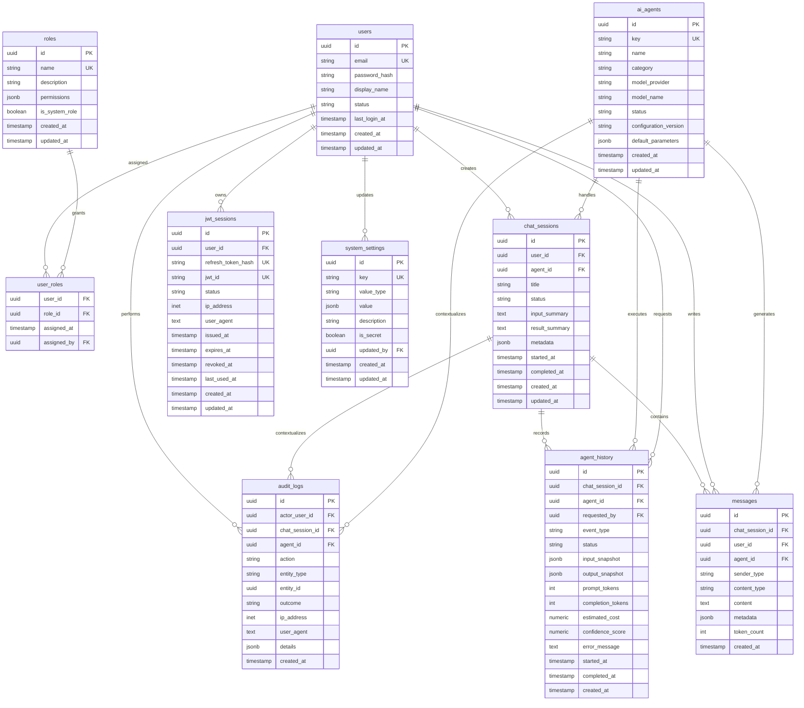

# PostgreSQL Database Schema Design

This document defines the proposed PostgreSQL data model for the AI-Powered DevOps Platform. It is intentionally conceptual and implementation-ready, but it does **not** include SQL DDL. The schema supports users, roles, chat sessions, messages, AI agents, agent history, audit logs, system settings, and JWT sessions.

## Design Goals

- Keep authentication, authorization, chat data, agent configuration, and audit data clearly separated.
- Preserve complete conversation and agent execution history for troubleshooting, governance, and product analytics.
- Support role-based access control without hard-coding permissions into application code.
- Support secure JWT refresh-session rotation and revocation.
- Use UUID primary keys for externally referenced records.
- Include timestamps on all operational tables for lifecycle tracking and auditability.
- Store flexible AI metadata in `jsonb` columns where provider-specific details may evolve.

## Entity Relationship Diagram

## Table Explanations

### `users`

Stores the identity record for every person who can authenticate to the platform.

| Column | Purpose |
| --- | --- |
| `id` | Stable UUID primary key used by related tables. |
| `email` | Unique login identifier and notification address. |
| `password_hash` | Secure password hash; plaintext passwords are never stored. |
| `display_name` | Human-readable user name shown in the UI and audit views. |
| `status` | Account lifecycle state such as `active`, `invited`, `disabled`, or `locked`. |
| `last_login_at` | Most recent successful login timestamp. |
| `created_at`, `updated_at` | Standard record lifecycle timestamps. |

Key relationships:

- One user can have many role assignments through `user_roles`.
- One user can create many `chat_sessions` and `messages`.
- One user can own many `jwt_sessions`.
- User activity is captured in `audit_logs`.

### `roles`

Defines authorization groups used by role-based access control.

| Column | Purpose |
| --- | --- |
| `id` | UUID primary key. |
| `name` | Unique role name, for example `admin`, `engineer`, `reviewer`, or `readonly`. |
| `description` | Human-readable explanation of the role. |
| `permissions` | JSON permission document, for example allowed actions, scopes, and admin capabilities. |
| `is_system_role` | Prevents built-in roles from being accidentally deleted or renamed. |
| `created_at`, `updated_at` | Standard lifecycle timestamps. |

Key relationships:

- Roles are assigned to users through `user_roles`.
- Authorization middleware can load user roles and evaluate the `permissions` document.

### `user_roles`

Join table that implements the many-to-many relationship between `users` and `roles`.

| Column | Purpose |
| --- | --- |
| `user_id` | User receiving the role assignment. |
| `role_id` | Role granted to the user. |
| `assigned_at` | Timestamp when the role was granted. |
| `assigned_by` | Optional user who granted the role. |

Recommended constraints:

- Composite uniqueness on `user_id` and `role_id` so the same role is not assigned twice.
- Foreign keys to `users.id` and `roles.id`.

### `chat_sessions`

Represents a user-facing conversation or analysis workspace with an AI agent.

| Column | Purpose |
| --- | --- |
| `id` | UUID primary key for the conversation. |
| `user_id` | User who created the session. |
| `agent_id` | AI agent selected for the session. |
| `title` | Display title generated by the user or system. |
| `status` | Session state such as `open`, `processing`, `completed`, `failed`, or `archived`. |
| `input_summary` | Short summary of the submitted DevOps problem or artifact. |
| `result_summary` | Final answer or outcome summary. |
| `metadata` | Flexible JSON for tags, source workflow, artifact references, or UI state. |
| `started_at` | Time when active processing began. |
| `completed_at` | Time when the session reached a terminal state. |
| `created_at`, `updated_at` | Standard lifecycle timestamps. |

Key relationships:

- A user can create many chat sessions.
- An AI agent can handle many chat sessions.
- A chat session contains many `messages` and many `agent_history` events.

### `messages`

Stores every user, assistant, system, and tool message that appears in a chat session.

| Column | Purpose |
| --- | --- |
| `id` | UUID primary key. |
| `chat_session_id` | Conversation that owns the message. |
| `user_id` | User author when `sender_type` is user-generated. Nullable for system or agent messages. |
| `agent_id` | Agent author when `sender_type` is agent-generated. Nullable for user messages. |
| `sender_type` | Message source, for example `user`, `agent`, `system`, or `tool`. |
| `content_type` | Payload format such as `text`, `markdown`, `json`, or `artifact_reference`. |
| `content` | Message body. |
| `metadata` | JSON metadata such as redaction flags, model trace IDs, citations, or attachment references. |
| `token_count` | Token estimate for cost analysis and context-window management. |
| `created_at` | Message creation timestamp. |

Key relationships:

- Each message belongs to one `chat_sessions` record.
- Messages may reference either a user or an AI agent depending on the sender type.

### `ai_agents`

Defines the available AI agents and their runtime configuration metadata.

| Column | Purpose |
| --- | --- |
| `id` | UUID primary key. |
| `key` | Stable unique application identifier such as `kubernetes_troubleshooter`. |
| `name` | Human-readable display name. |
| `category` | Domain category such as Kubernetes, Docker, Terraform, GitHub Actions, Linux, or general DevOps. |
| `model_provider` | Provider abstraction name used by the orchestration layer. |
| `model_name` | Default model used by this agent. |
| `status` | Agent lifecycle state such as `enabled`, `disabled`, `deprecated`, or `maintenance`. |
| `configuration_version` | Version of prompts, tools, policies, and output schema used by the agent. |
| `default_parameters` | JSON defaults for temperature, max tokens, tool policy, output schema, or safety settings. |
| `created_at`, `updated_at` | Standard lifecycle timestamps. |

Key relationships:

- One AI agent can handle many `chat_sessions`.
- One AI agent can generate many `messages`.
- Every execution attempt is recorded in `agent_history`.

### `agent_history`

Captures operational history for each AI-agent execution, including retries, failures, cost metrics, and output snapshots.

| Column | Purpose |
| --- | --- |
| `id` | UUID primary key. |
| `chat_session_id` | Chat session associated with the execution. |
| `agent_id` | Agent that executed the request. |
| `requested_by` | User who triggered the execution. |
| `event_type` | Execution event such as `initial_response`, `follow_up`, `retry`, `tool_call`, or `summary_generation`. |
| `status` | Execution status such as `queued`, `running`, `succeeded`, `failed`, or `cancelled`. |
| `input_snapshot` | JSON snapshot of normalized input, prompt metadata, and selected context. |
| `output_snapshot` | JSON snapshot of structured agent output, findings, or tool results. |
| `prompt_tokens` | Number of prompt tokens used. |
| `completion_tokens` | Number of completion tokens generated. |
| `estimated_cost` | Estimated provider cost for this execution. |
| `confidence_score` | Optional model or application-derived confidence value. |
| `error_message` | Failure message for unsuccessful executions. |
| `started_at`, `completed_at` | Execution timing fields. |
| `created_at` | Record creation timestamp. |

Key relationships:

- A chat session can have many agent-history rows, especially for multi-turn conversations and retries.
- Agent-history records support analytics, debugging, audit review, and cost reporting.

### `audit_logs`

Immutable governance log for security-sensitive and business-critical actions.

| Column | Purpose |
| --- | --- |
| `id` | UUID primary key. |
| `actor_user_id` | User who performed the action, nullable for system jobs. |
| `chat_session_id` | Optional related chat session. |
| `agent_id` | Optional related AI agent. |
| `action` | Action name such as `login.success`, `role.assigned`, `session.created`, or `agent.executed`. |
| `entity_type` | Type of entity affected by the action. |
| `entity_id` | UUID of the affected entity when applicable. |
| `outcome` | Result such as `success`, `failure`, or `denied`. |
| `ip_address` | Source IP address for user-initiated actions. |
| `user_agent` | HTTP user-agent string for request attribution. |
| `details` | JSON details with before/after values, failure reasons, or policy decisions. |
| `created_at` | Time the audit event was recorded. |

Recommended behavior:

- Treat audit rows as append-only.
- Avoid storing secrets in `details`.
- Log authentication, authorization denials, role changes, setting changes, session creation, agent execution, and token revocation.

### `system_settings`

Stores platform-level configuration that should be managed through the application instead of static deployment variables.

| Column | Purpose |
| --- | --- |
| `id` | UUID primary key. |
| `key` | Unique setting key such as `agent.max_context_tokens` or `auth.refresh_token_ttl_days`. |
| `value_type` | Expected value type such as `string`, `number`, `boolean`, `json`, or `secret_ref`. |
| `value` | JSON value for the setting. Secrets should be references, not plaintext secret values. |
| `description` | Human-readable setting purpose. |
| `is_secret` | Indicates whether the value must be masked in UI and logs. |
| `updated_by` | User who last changed the setting. |
| `created_at`, `updated_at` | Standard lifecycle timestamps. |

Key relationships:

- Setting changes should create `audit_logs` records.
- `updated_by` links settings administration back to a user.

### `jwt_sessions`

Tracks refresh-token-backed login sessions for JWT authentication.

| Column | Purpose |
| --- | --- |
| `id` | UUID primary key. |
| `user_id` | User who owns the session. |
| `refresh_token_hash` | Hash of the refresh token; raw refresh tokens are never stored. |
| `jwt_id` | Unique JWT identifier used for rotation, revocation, or deny-list integration. |
| `status` | Session state such as `active`, `rotated`, `revoked`, or `expired`. |
| `ip_address` | IP address that created or last used the session. |
| `user_agent` | Client user-agent for session visibility and anomaly detection. |
| `issued_at` | Time the token session was issued. |
| `expires_at` | Refresh-session expiration timestamp. |
| `revoked_at` | Time the session was revoked, if applicable. |
| `last_used_at` | Last successful refresh or authenticated session activity. |
| `created_at`, `updated_at` | Standard lifecycle timestamps. |

Recommended behavior:

- Rotate refresh tokens on every refresh.
- Revoke a token family if reuse of an old refresh token is detected.
- Keep access tokens short-lived and use `jwt_sessions` for refresh-token lifecycle control.

## Recommended Indexes and Constraints

- `users.email` unique index for login lookup.
- `roles.name` unique index for role lookup.
- `user_roles(user_id, role_id)` unique composite index.
- `chat_sessions(user_id, created_at)` index for user history screens.
- `chat_sessions(agent_id, status)` index for agent workload views.
- `messages(chat_session_id, created_at)` index for ordered conversation retrieval.
- `ai_agents.key` unique index for stable application lookup.
- `agent_history(chat_session_id, created_at)` index for execution timelines.
- `agent_history(agent_id, status, created_at)` index for operational dashboards.
- `audit_logs(actor_user_id, created_at)` index for user activity investigations.
- `audit_logs(entity_type, entity_id, created_at)` index for entity-level audit views.
- `system_settings.key` unique index for configuration lookup.
- `jwt_sessions(refresh_token_hash)` unique index for secure refresh-token validation.
- `jwt_sessions(user_id, status, expires_at)` index for active session management.

## Notes for Future SQL Generation

When SQL is generated later, the implementation should include:

- PostgreSQL `uuid` primary keys generated by the application or database extension.
- `jsonb` for flexible metadata columns.
- `timestamptz` for all timestamps.
- Enumerated values through PostgreSQL enums or constrained text columns.
- Foreign keys with explicit delete behavior.
- Migration files managed through the backend migration tool.
- No plaintext secrets in any table.
