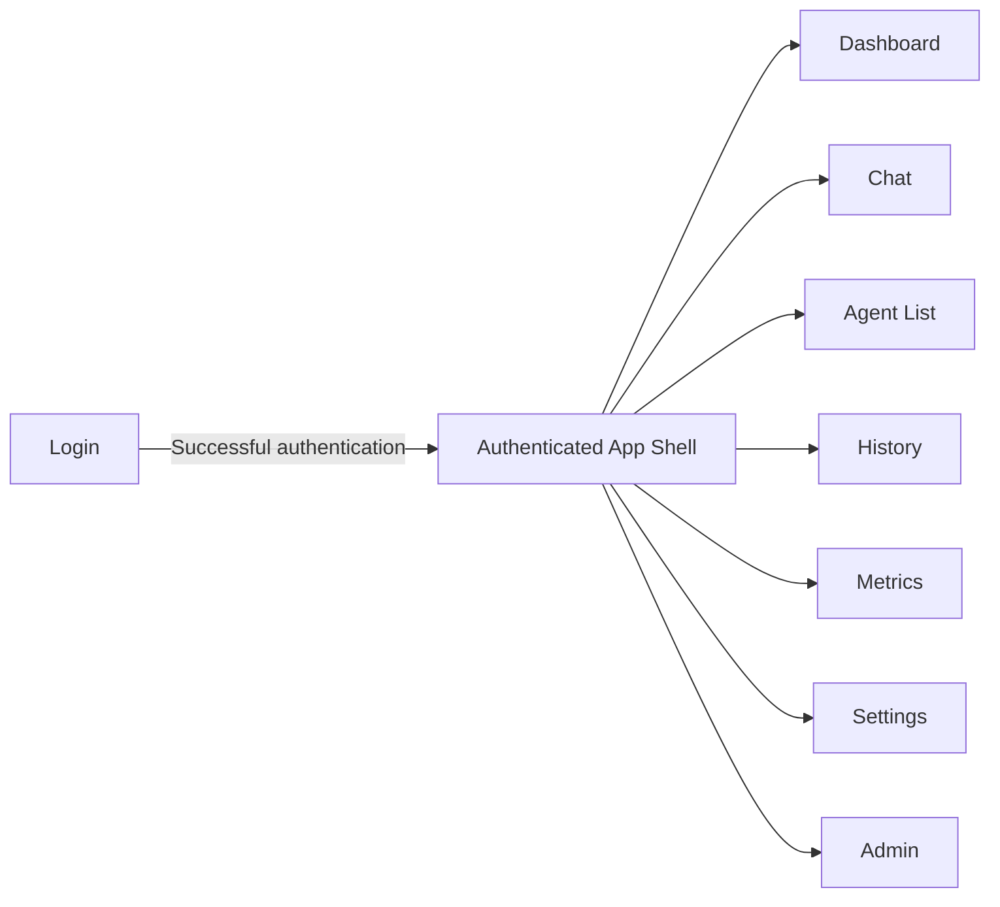
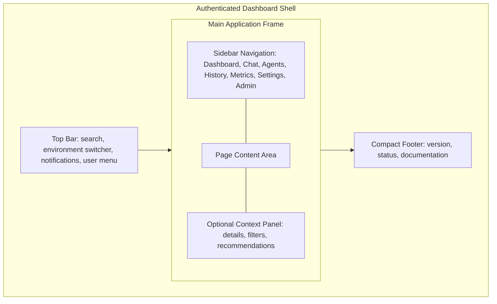
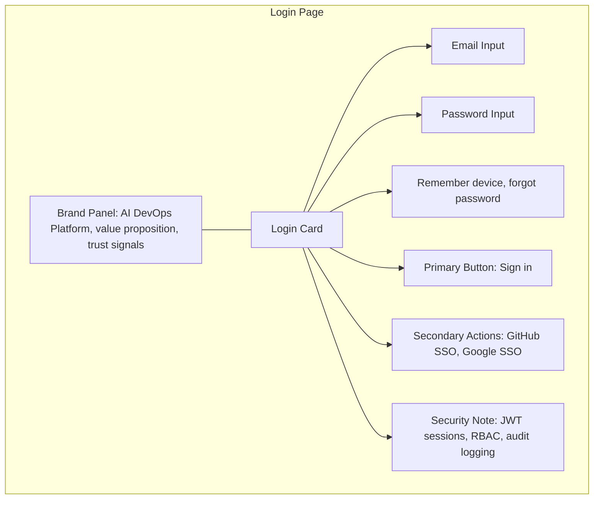
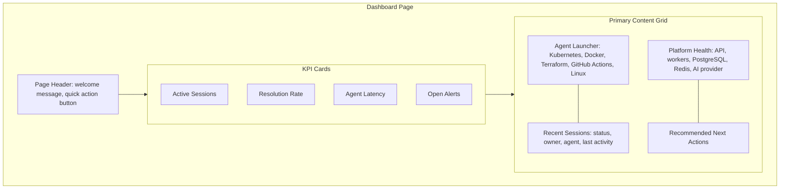
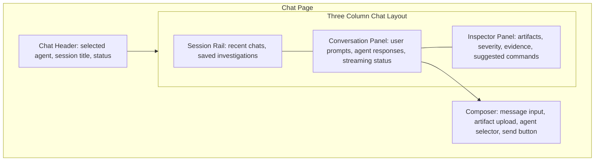
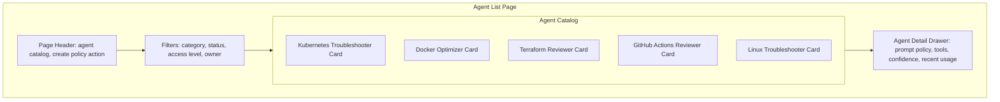
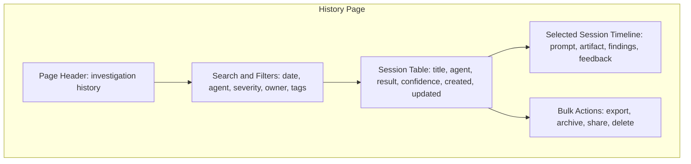
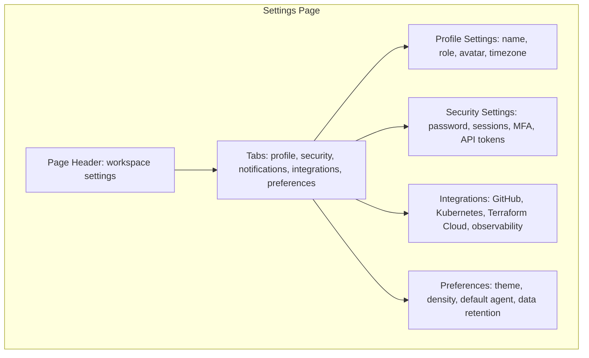
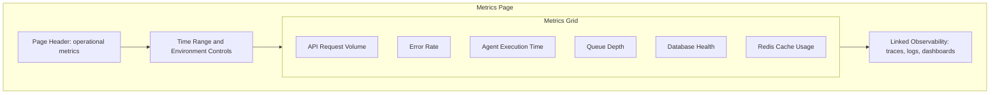
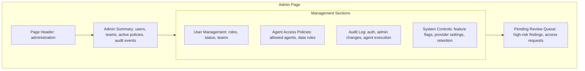

# Modern React Dashboard Wireframes

This document defines low-fidelity Mermaid wireframes for a modern React dashboard experience for the AI-Powered DevOps Platform. These wireframes are intentionally implementation-agnostic and do not include React code.

## Design System Direction

- **Visual style:** modern SaaS interface with dark-first theming, soft cards, subtle borders, rounded panels, and clear operational status indicators.
- **Layout model:** authenticated pages use a persistent left sidebar, top command bar, responsive content grid, and context-aware right panels where useful.
- **Navigation:** primary routes include Dashboard, Chat, Agent List, History, Metrics, Settings, and Admin.
- **Interaction priorities:** fast agent selection, visible platform health, searchable history, clear permissions, and explainable AI session outputs.
- **Responsive behavior:** desktop uses multi-column layouts; tablet collapses secondary panels; mobile collapses navigation into a drawer and stacks cards vertically.

## Route Map

## Shared Authenticated App Shell

## Login Page

## Dashboard Page

## Chat Page

## Agent List Page

## History Page

## Settings Page

## Metrics Page

## Admin Page

## Information Architecture Notes

- **Dashboard** is the operational landing page and should optimize for immediate awareness and quick agent launches.
- **Chat** is the primary work surface and should preserve context between messages, artifacts, findings, and recommended commands.
- **Agent List** acts as a governed catalog where users understand each agent's purpose, permissions, supported inputs, and recent performance.
- **History** supports auditability, repeatability, and knowledge reuse through searchable AI-assisted sessions.
- **Metrics** connects product usage with platform health so SRE and platform teams can evaluate latency, errors, queues, and dependencies.
- **Admin** centralizes RBAC, policy management, audit records, feature flags, and operational controls.
